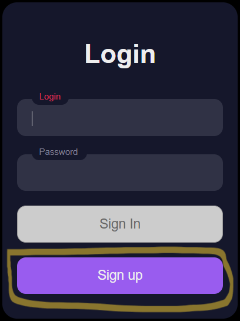
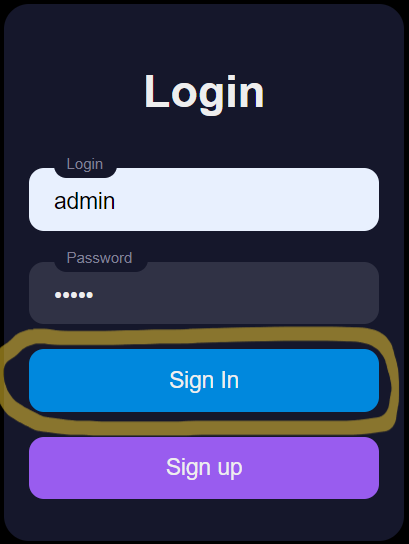
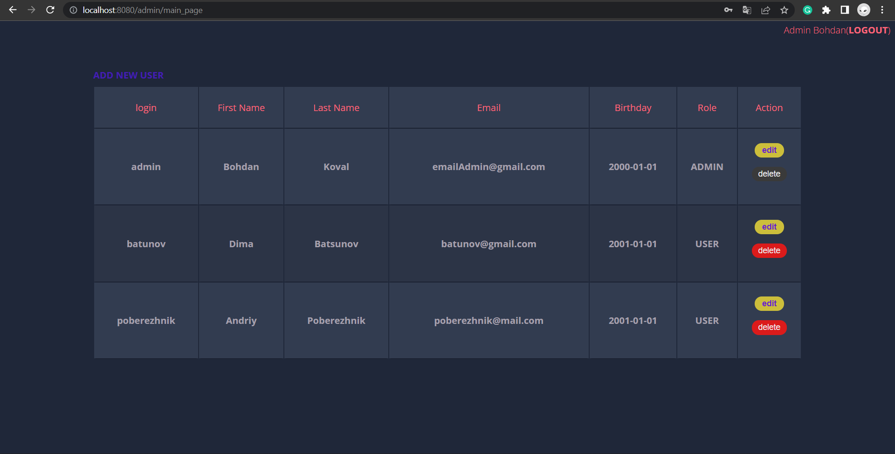

<h1>Managing project</h1>

<h3>In order to run the project with a docker - you need </h3>
* open terminal 
* come to project folder 
* run command <code>docker compose up </code> 
* wait and enjoy 
* open browser 
* and finally go to <code>localhost:8080</code> 

<h3>You can log in</h3>
* admin <code> login: admin, password: admin</code> 
* user <code> login: user, password: user</code>

<h3>Or sign up</h3>

<h3>If you log in as an admin </h3>

<h3>you will see a table with all users</h3>

Technologies:
* Java 11
* Spring Core
* Spring Security
* Spring Web MVC
* reCaptcha
* Hibernate
* Docker
* Tomcat
* H2 database
* JSP & JSTL
* CSS
